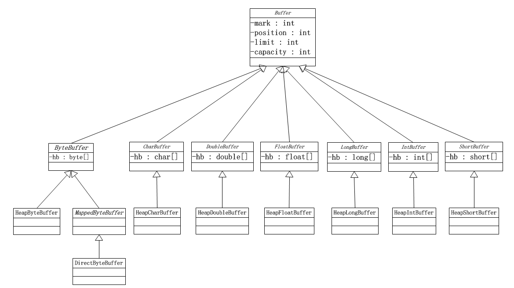
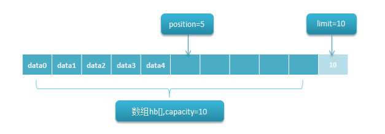
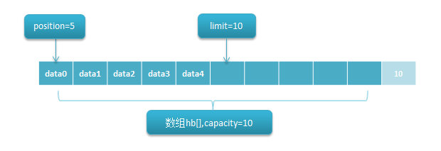
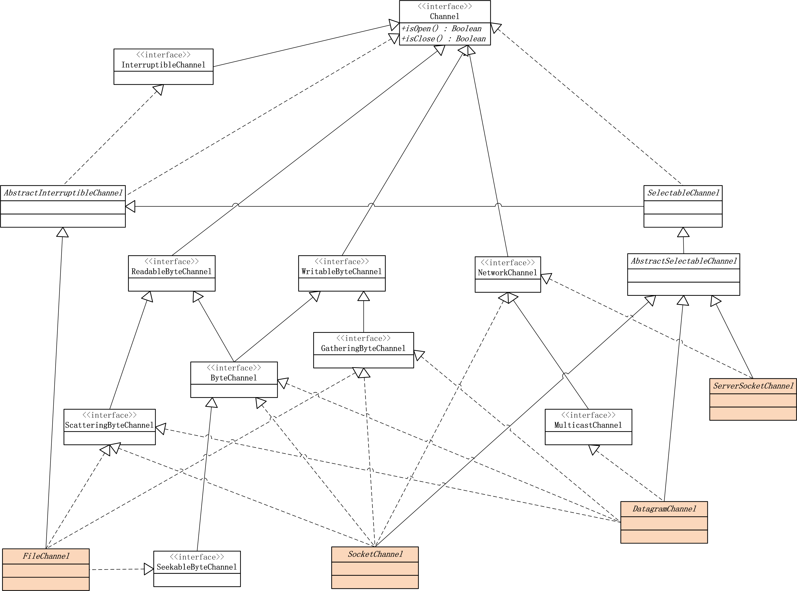

# NIO
> 新IO或非阻塞IO

## 缓冲Buffer

主要Buffer：

- ByteBuffer
- CharBuffer
- DoubleBuffer
- FloatBuffer
- IntBuffer
- LongBuffer
- ShortBuffer

### 整体类图

> 只画出涉及的部分类类图，图中斜体的类都是抽象类

`Buffer`是所有类型缓冲区的父类，根据java的基本类型扩展出了不同类型的缓冲区：`ByteBuffer,CharBuffer,DoubleBuffer,FloatBuffer,IntBuffer,LongBuffer,ShortBuffer`,它们的实现类一般都为`HeapXXXBuffer`，当使用`XXXBuffer.allocate()`方法进行分配时就是创建`HeapXXXBuffer`对象。说明一下缓冲区中几个比较基础、关键的属性：

- hb：不同类型缓冲对应的数组，例如char[],byte[]等，用来存放缓冲的数据
- capacity：hb数组的大小，即缓冲区可以存放元素最大数目
- position：记录下一个即将要读取或者写入的元素的位置，因为通道是双向的，所以它表示两种含义
- limit：第一个不应该读取或写入的元素的索引位置。例如缓冲区有5个元素[0,1,2,3,4]，读取时，limit=position(调用flip())；写入时，limit=capacity(分配缓冲区时)
- mark：临时记录position，通过reset()来将position恢复回mark

### 缓冲区规则 

0<=mark<=position<=limit<=capacity

对缓冲区的一些操作都需要满足以上规则，有些特殊的除外，例如`get(int index)`这个操作直接在index位置读取一个元素，正常情况下，读取元素的位置应该position.

### Buffer实现原理
> 缓冲区的实现最终就是对缓冲区中的数组进行操作管理。

*向缓冲区写入数据*

创建一个容量为10的缓冲区，并向其中插入5个元素(data0-4),这个时候position则指向数组索引为5的位置，而limit指向越界的数组索引10，因为0-9都属性数组范围，可以被写入数据。

*从缓冲区读取数据*

接着上面写入了5个元素后，现在想从缓冲区中读取写入的元素(一般都是缓冲区满了才会把里面的元素读取出来)。此时通过`flip()`方法从写入模式切换到读取模式。当然也可以结合`get(int index)`方法循环读取数组hb的所有元素。

### Buffer常用操作

- 创建缓冲区

    	ByteBuffer.allocate(int capacit); //指定容量
    	ByteBuffer.wrap(byte[] array);	//通过已有数组

- 往缓冲区写数据
	
    	Channel.read(ByteBuffer buffer); //从通道读取数据到缓冲区
    	put(byte v);	//往缓冲区写入一个元素，position位置
    	put(byte[] src, int offset, int length)	//写入一个数组
    	put(int i, byte x);	//在第i位置写入元素x
    	put(ByteBuffer src);	//把一个缓冲区src写到另一个缓冲区

- 向缓冲区读数据
		
		Channel.write(ByteBuffer buffer); //从Buffer读取数据到Channel
		get();//获取position位置元素
		get(int i); //获取位置i的元素
		get(byte[] dst, int offset, int length);//读取数据并写到dst数组中
		getXXX(); //读取元素并包装成char,int,long等类型

- 写入模式切换到读取模式`flip()`

	        limit = position; //最多读limit以前的元素
	        position = 0; //从第一个元素开始读取

- 重读缓冲区`rewind()`
		
	        position = 0;	//重置position
	        mark = -1;  //抛弃之前的mark
	    
- 清空缓冲区`clear()`

	有时缓冲区满后，需要进行清除才能继续住里写数据，这个操作将会清空之前缓冲区里的数据，无论是已经读取还是未读取的。

	        position = 0;
	        limit = capacity;
	        mark = -1;

- 压缩缓冲区`compact()`

	将未读取的数据复制到缓冲区的头部，并调整position,limit为适当的值，不像`clear()`把整个缓冲区清空。

- 标记位置`mark()`
	
	 简单地记录下position的值：mark=position

- 重置位置`reset()`

	根据之前的标记mark重置position:position=mark

### 使用步骤

1. 首先分配缓冲区大小:`ByteBuffer.allocate(1024)`
2. 写入(通过通道)数据到Buffer：`channel.read(buffer)`
3. 调用flip()方法：将Buffer从写模式切换到读模式，其实就是调整position,limit值
4. 从Buffer中读取数据
5. 调用clear()方法或者compact()方法：清空整个缓冲区&&清除已经读过的数据，然后再回到步骤2

## Channel

通道表示到实体，如硬件设备、文件、网络套接字或可以执行一个或多个不同 I/O 操作（如读取或写入）的程序组件的开放的连接。 

主要Channel

- FileChannel：从文件中读写数据
- DatagramChannel：通过UDP读写网络中的数据
- SocketChannel：通过TCP读写网络中的数据
- ServerSocketChannel：可以监听新进来的TCP连接，像Web服务器那样。对每一个新进来的连接都会创建一个SocketChannel。

以操作对象来区别，则分为两大类：文件通道以及socket通道。
Socket通道有三个，分别是`ServerSocketChannel、SocketChannel`和`DatagramChannel`，而它们又分别对 应java.net包中的Socket对象`ServerSocket、Socket`和`DatagramSocket`；Socket通道被实例化时，都会创 建一个对等的Socket对象。Socket通道可以运行非阻塞模式并且是可选择的，非阻塞I/O与可选择性是紧密相连的，这也正是管理阻塞的API要在 `SelectableChannel`中定义的原因。设置非阻塞非常简单，只要调用`configureBlocking(false)`方法即可。如果需要中 途更改阻塞模式，那么必须首先获得`blockingLock()`方法返回的对象的锁。 

### 通道类图

### FileChannel
用来读、写、映射和操纵文件的channel.
可从现有的 `FileInputStream`、`FileOutputStream` 或 `RandomAccessFile` 对象获得文件通道

#### 代码示例

[czm.java.core.nio.FileChanelTest](https://github.com/1032851561/JavaCoreStd/blob/master/src/main/java/czm/java/core/nio/FileChannelTest.java)

### ServerSocketChannel

可以**监听**新进来的TCP连接的通道, 就像标准IO中的ServerSocket一样

#### 代码示例

[czm.java.core.nio.ServerSocketChannelTest](https://github.com/1032851561/JavaCoreStd/blob/master/src/main/java/czm/java/core/nio/ServerSocketChannelTest.java)

### SocketChannel

SocketChannel是一个**连接**到TCP网络套接字的通道

#### 代码示例

[czm.java.core.nio.SocketChannelTest](https://github.com/1032851561/JavaCoreStd/blob/master/src/main/java/czm/java/core/nio/SocketChannelTest.java)

### DatagramChannel

DatagramChannel是一个能收发UDP包的通道。因为UDP是无连接的网络协议，所以不能像其它通道那样读取和写入。它发送和接收的是数据包。

可以将DatagramChannel“连接”到网络中的特定地址的。由于UDP是无连接的，连接到特定地址并不会像TCP通道那样创建一个真正的连接。而是锁住DatagramChannel ，让其只能从特定地址收发数据。它是无连接的，它既可以作为服务器，也可以作为客户端。

#### 代码示例

[czm.java.core.nio.DatagramChannelTest](https://github.com/1032851561/JavaCoreStd/blob/master/src/main/java/czm/java/core/nio/DatagramChannelTest.java)

## Selector

Selector（选择器）是Java NIO中能够检测一到多个NIO通道，并能够知晓通道是否为诸如读写事件做好准备的组件。这样，一个单独的线程可以管理多个channel，从而管理多个网络连接。

> IO多路复用是指内核一旦发现进程指定的一个或者多个IO条件准备读取，它就通知该进程

#### 代码示例

[czm.java.core.nio.DatagramChannelClientDemo](https://github.com/1032851561/JavaCoreStd/blob/master/src/main/java/czm/java/core/nio/DatagramChannelClientDemo.java)

[czm.java.core.nio.DatagramChannelServerDemo](https://github.com/1032851561/JavaCoreStd/blob/master/src/main/java/czm/java/core/nio/DatagramChannelServerDemo.java)